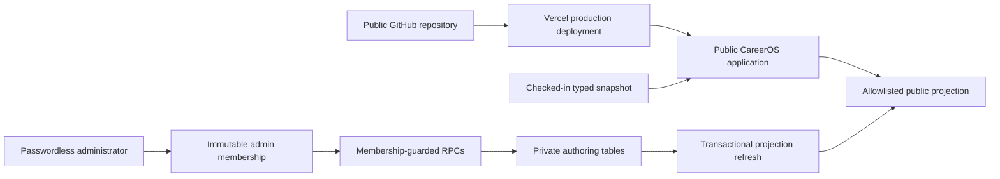

# CareerOS

CareerOS is Jason Stroup's public, recruiter-safe technical portfolio and a
working personal career-development system. It connects professional identity,
projects, learning, delivery work, evidence, capabilities, and role lenses
without presenting planned work as completed proof.

**Live site:** [www.jasonstroup.website](https://www.jasonstroup.website)

**Source:**
[stroupjason/jason-stroup-careeros](https://github.com/stroupjason/jason-stroup-careeros)

This repository is public so recruiters and technical reviewers can inspect
CareerOS source code, architecture, domain modeling, tests, migrations,
production fixes, and release history. No open-source license is currently
granted; public visibility is for portfolio and technical-review purposes.

## Professional identity

> Customer-Facing Technical Systems Professional

Jason works across technical solutions, SaaS integrations, application
support, troubleshooting, data, and software delivery. CareerOS presents
several related role lenses over the same evidence instead of claiming that
Jason currently holds every supported title.

## Current production state

The current application feature baseline was released on August 8, 2026. The
Delivery Intelligence release at
[`6d80f0f`](https://github.com/stroupjason/jason-stroup-careeros/commit/6d80f0f1109f2c8e3a49ff570c54fa742321f005)
is followed by the public-indexing and stable-admin-entry update at
[`a992fc7`](https://github.com/stroupjason/jason-stroup-careeros/commit/a992fc73732dea71afe02b41f6d3d3eb217a07f2).

CareerOS currently includes:

- A name-first professional homepage and evidence-backed project portfolio
- Role-fit views for current, adjacent, bridge, long-term, and exploratory paths
- A focused Learning overview with current courses, exact state counts, recent
  approved evidence, and a searchable public Delivery board
- A Career Track, LinkedIn Learning SQL record, and CU Boulder MS-CS Network
  Systems pathway with three linked course records
- Passwordless recovery and Windows Hello passkey re-entry backed by Supabase
  Auth and immutable single-administrator membership
- Durable ticket, session, progress, evidence, blocker, checklist, and audit data
- Delivery Intelligence with deterministic flow metrics, an interactive
  planned/actual/open/completed timeline, an explicit Unscheduled lane, and an
  Evidence Delivery Map
- Three canonical operational Bugs with sanitized public RCA records
- A private, membership-protected Bug Log for classification and observations
- A checked-in static public snapshot that keeps the public site available when
  the backend is unavailable

At this release point, the reviewed data contains:

| Scope | Count | Meaning |
|---|---:|---|
| Stable seed baseline | 22 | Historical, explicitly scoped ticket-key subset |
| Pre-Delivery Intelligence public scope | 39 | Public projection before the current feature release |
| Reviewed source tickets | 53 | Recovery snapshot and idempotent stable-key seed |
| Canonical ticket state | Live | Durable production records remain authoritative for mutable fields |
| Canonical Bugs | 4 | Three operational defects plus the deferred passkey-provider compatibility Bug |
| Private incident/RCA records | 3 | Membership-protected operational records linked by stable Bug key |

The release-time Delivery Intelligence view reports 12 current WIP items, 12
verified completions in the preceding 30 days, and a median cycle time below
one day across nine tickets with comparable actual-start and completion data.
These values are derived from live records and will change as the board moves.

## Product surfaces

### Portfolio

- `/` - professional identity, positioning, featured work, and calls to action
- `/projects` - project index and individual evidence-backed project pages
- `/skills` - skills grouped by Demonstrated, Practicing, Learning, and Planned
- `/roles` - recruiter role lenses over one professional identity
- `/writing` - public technical writing
- `/roadmap` - portfolio Delivery Intelligence and execution sequence
- `/resume-contact` - resume and contact surface

### Learning and delivery

- `/learning` - compact Career Track context, exact course states, current
  courses, highest next action, and newest approved evidence
- `/learning/board` - canonical Delivery workspace with pulse, URL-backed
  search, shareable filters, board, and backlog
- `/learning/board?type=Bug` - canonical public Bugs view
- `/learning/timeline` - URL-filterable delivery kinds plus approved chronology
- `/learning/tickets/:ticketKey` - public ticket detail and truth boundary
- `/admin` - stable, unadvertised administrator entry point and workspace chooser
- `/admin/login` - cross-browser email recovery callback and passkey sign-in
- `/admin/operations/bugs` - unadvertised private Bug classification and RCA view

The full route inventory lives in [`docs/SITE_MAP.md`](docs/SITE_MAP.md).

## Architecture

CareerOS is a React single-page application deployed from GitHub to Vercel.
Supabase provides the selected persistence and authentication layer.



### Frontend

- React 19
- TypeScript
- Vite
- Lucide icons
- Vercel Web Analytics
- Accessible semantic lists, forms, filters, and status controls
- Responsive desktop, tablet, and narrow-mobile layouts

### Backend and authorization

- Supabase Postgres and Auth
- Passwordless email sign-in with `shouldCreateUser: false`
- Exactly one pre-provisioned administrator mapped by immutable Auth user ID
- Row Level Security on private authoring and operational tables
- `SECURITY DEFINER` RPCs that re-check private membership server-side
- Optimistic revisions for mutation conflict detection
- Append-only audit events and controlled public-derivative publication
- Anonymous access limited to allowlisted public DTOs

The browser receives only a Supabase project URL and publishable key. Service
keys, database credentials, private notes, raw logs, account identifiers, and
private academic data do not belong in the client bundle or public projection.

See [`docs/LEARNING_ADMIN_BACKEND.md`](docs/LEARNING_ADMIN_BACKEND.md) for the
backend decision, data boundary, migrations, and rollback process.

## Learning and evidence model

CareerOS uses the following traceable relationship:

`Career objective -> Initiative -> Epic -> Story/Task/Bug/Spike -> Work session -> Evidence -> Capability -> Role lens -> Public project`

Delivery status, roadmap status, evidence maturity, course progress, and role
fit remain separate concepts. CareerOS does not combine them into a single
score.

Public evidence uses four states:

- **Demonstrated** - supported by professional experience or verified working proof
- **Practicing** - actively exercised through approved work or independent builds
- **Learning** - active development without a mastery claim
- **Planned** - intentionally deferred

Course progress is published only from timestamped, reviewed snapshots. Course
completion does not automatically prove capability, complete an applied
project, establish degree progress, or imply role readiness.

## Delivery Intelligence

The project board remains CareerOS's canonical operating core. Delivery
Intelligence provides portfolio and Learning-scoped views over those records.

- WIP includes In Progress, Blocked, and In Review tickets
- Throughput uses verified completion timestamps in the selected window
- Cycle time uses only tickets with compatible actual-start and completion data
- Planned bars require a planned start and target date
- Actual bars require an actual start
- Completion-only records render as milestones
- Missing schedule inputs remain explicitly Unscheduled
- Story points are never converted into hours
- Learning activity, evidence maturity, and role fit are not treated as flow metrics

The implementation and focused tests live in
[`src/data/deliveryIntelligence.ts`](src/data/deliveryIntelligence.ts) and
[`src/data/deliveryIntelligence.test.ts`](src/data/deliveryIntelligence.test.ts).

## Operational evidence

Every accepted defect remains one canonical board Bug. The private Bug Log
adds classification, linked incident context, diagnostic notes, observations,
revision control, audit events, and public-derivative review without becoming a
second work tracker.

The current resolved Bugs are:

- `PRODUCT-236` - restored immutable administrator membership authorization
- `PRODUCT-237` - recovered passwordless delivery after provider throttling
- `PRODUCT-238` - corrected ambiguous acceptance-item indexes in two database functions

`PRODUCT-239` keeps custom SMTP evaluation in Backlog. SMTP is the relevant
mail-delivery protocol; SFTP is unrelated. No SMTP provider, DNS change, secret,
or production delivery claim has been made.

Raw Supabase logs are not copied into CareerOS. A future operational-health
dashboard remains Backlog until its server boundary, credentials, redaction,
retention, cost, privacy, and human-review gates are approved.

## Repository structure

```text
src/
  admin/                 Authenticated admin context and authoring controls
  components/            Shared public and private interface components
  data/                  Typed public-safe CareerOS and Learning records
  pages/                 Route-level application surfaces
  lib/                   Supabase client and shared infrastructure
supabase/
  migrations/            Transactional forward migrations
  rollback/              Reviewed rollback scripts
docs/                     Architecture, evidence, route, and integration decisions
public/                   Publicly owned media and reviewed downloadable assets
```

## Run locally

Requirements:

- Node.js 22
- npm 11

```bash
npm ci
npm run dev
```

The public static fallback works without Supabase configuration. To exercise
the backend-enabled client, configure these browser-safe values locally without
committing the environment file:

```text
VITE_SUPABASE_URL
VITE_SUPABASE_PUBLISHABLE_KEY
```

Do not add a service-role key, database password, JWT secret, or other private
credential to a `VITE_*` variable.

## Validate

```bash
npm run typecheck
npm test
npm run build
npm run preview
```

The current release passes TypeScript validation, 66 automated tests, the Vite
production build, direct-route refresh checks, confidentiality scanning, and
desktop/tablet/mobile browser verification. The production bundle currently
has a non-blocking Vite chunk-size advisory that remains an optimization item.

## Database migrations

Apply migrations in repository order to the approved CareerOS Supabase project:

1. `supabase/migrations/20260808000100_learning_admin.sql`
2. `supabase/migrations/20260808000200_delivery_intelligence_operations.sql`

Matching rollback scripts live under `supabase/rollback/`. Preserve the
existing Auth user and immutable administrator membership; do not put either
identifier in a migration. Stable-key seed inserts are idempotent and do not
overwrite durable edits.

## Deployment and release workflow

GitHub is the source of truth. Vercel is the deployment target.

1. Make a focused change in this repository.
2. Run the applicable validation commands.
3. Review the diff and scan for confidential data or credentials.
4. Commit and push to a focused branch in the public GitHub repository.
5. Open a pull request and review its diff and automated checks.
6. Merge the reviewed pull request to let the existing Vercel Git integration build `main` for production.
7. Verify the unique deployment and canonical custom domain.
8. Record significant milestones with an annotated Git tag and GitHub Release.

### Production checkpoints

| Commit | Production checkpoint |
|---|---|
| [`a992fc7`](https://github.com/stroupjason/jason-stroup-careeros/commit/a992fc73732dea71afe02b41f6d3d3eb217a07f2) | Limited noindex behavior to private admin routes and added the stable `/admin` owner entry point |
| [`6d80f0f`](https://github.com/stroupjason/jason-stroup-careeros/commit/6d80f0f1109f2c8e3a49ff570c54fa742321f005) | Delivery Intelligence, canonical Bugs, private Bug Log, operational evidence, and 51-ticket parity |
| [`941520a`](https://github.com/stroupjason/jason-stroup-careeros/commit/941520a978083e6519f72f85baca36a9ca1651a9) | Repaired ambiguous acceptance-item indexes and restored the post-login seed |
| [`dd77cc4`](https://github.com/stroupjason/jason-stroup-careeros/commit/dd77cc45d922ab4bfc8040ee8121a3099c3481f2) | Added Supabase-backed Learning Admin and CU coursework records |
| [`8d02e12`](https://github.com/stroupjason/jason-stroup-careeros/commit/8d02e12830479816cdf71778816b89b91a23ec3e) | Recorded verified SQL course progress |
| [`f28816b`](https://github.com/stroupjason/jason-stroup-careeros/commit/f28816b258f64034d0abac38af35c1b91f5d750a) | Added current-learning progress history |

The next repository milestone should add a `CHANGELOG.md` and publish the first
formal GitHub Release without rewriting this commit history.

## Current boundaries and next work

- `SQL-002` remains In Progress; unknown work and completion evidence are not backfilled
- Custom SMTP remains an evaluation ticket, not a configured production feature
- LinkedIn Learning and Coursera progress remain human-reviewed snapshots; no
  unsupported provider synchronization is claimed
- The future live-log dashboard remains unimplemented
- Public sign-up stays disabled; administrator access remains passwordless and pre-provisioned
- Public routes are indexable; `/admin` and its child routes remain protected
  with `noindex`, `nofollow`, and `noarchive` directives
- Private-route sign-out, expiry, unauthorized deep-link, and non-admin denial
  remain targeted regression coverage under the existing verification work

## Confidentiality and truth boundary

Do not add employer code, customer data, production incidents, PHI, PII,
private academic records, recruiter or interview notes, credentials, copied
tickets, or non-public architecture to this repository.

Read these documents before changing public claims or data:

1. [`AGENTS.md`](AGENTS.md)
2. [`CONFIDENTIALITY.md`](CONFIDENTIALITY.md)
3. [`START_HERE.md`](START_HERE.md)
4. [`docs/EVIDENCE_MODEL.md`](docs/EVIDENCE_MODEL.md)
5. [`docs/PROJECT_BINDINGS.md`](docs/PROJECT_BINDINGS.md)
6. [`docs/ROLE_LENS_STRATEGY.md`](docs/ROLE_LENS_STRATEGY.md)

CareerOS is evidence-backed by design: unknowns remain unknown, planned work
remains planned, and public claims change only after reviewable proof exists.
